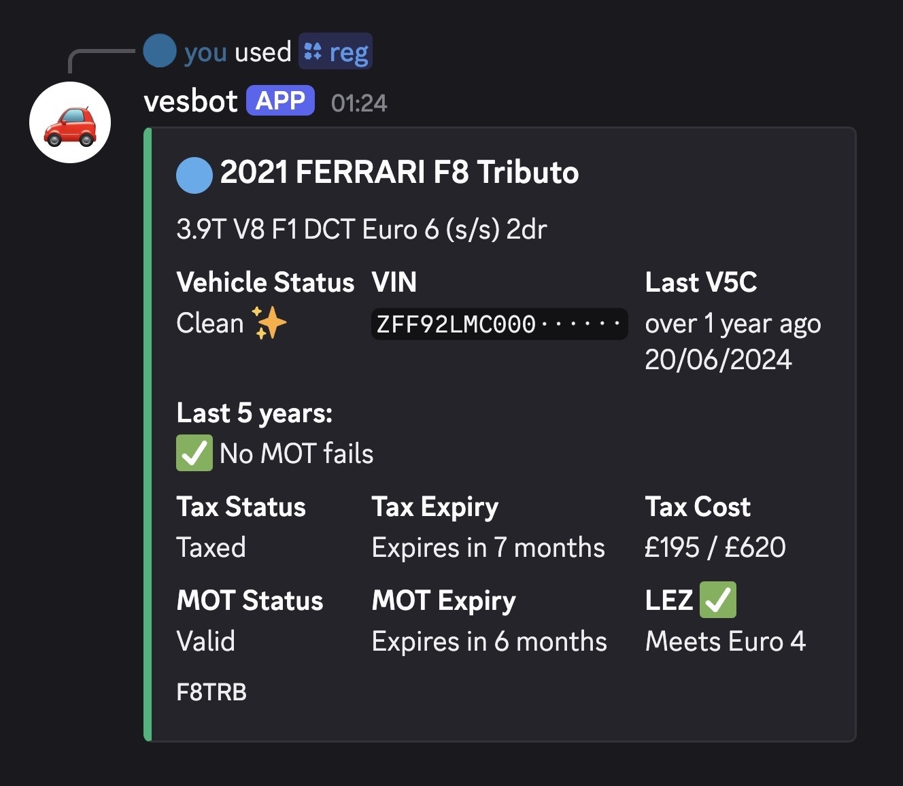

[](https://codecov.io/github/williamxb/vesbot)
[](https://github.com/williamxb/vesbot/actions/workflows/test.yml)
[](https://github.com/williamxb/vesbot/actions/workflows/docker-publish.yml)

# 🚗 vesbot | Vehicle Enquiry Bot for Discord
A Discord bot for checking UK vehicle details; MOT history, tax status, spurious history, and more.

  - Make, model, and spec/description
  - Vehicle status: Category write off, stolen, scrapped
  - Date of last V5C issue
  - Overview of MOT history
  - Tax and MOT status and expiry
  - Tax cost if calculable
  - LEZ compliance estimate if calculable

## Usage
### Discord command:
`/reg <registration>` - Look up registration



## Prerequisites
 - Node.js v25, npm
 - [Discord App](https://discord.com/developers/docs/quick-start/getting-started)
 - Environment tokens set up - see `.env.example`
 - (Optional) Docker for containerised deployment

## Installation

### Node.js
```bash
# Clone repo
git clone https://github.com/williamxb/vesbot.git
cd vesbot

# Install dependencies
npm i

# Populate .env with required values

# Start the bot
node .

# Optional: use Nodemon to watch for file changes
npx nodemon .
```

## Deployment
### GitHub Container Registry
Images are built and published to GHCR:

Docker:
```bash
# Pull container
docker pull ghcr.io/williamxb/vesbot:main

# Run container
docker run -d \
  --name vesbot \
  --env-file .env \
  ghcr.io/williamxb/vesbot:main
```

Docker Compose:
```yaml
# docker-compose.yml

services:
  vesbot:
    image: ghcr.io/williamx/vesbot:main
    container_name: vesbot
    env_file: .env
    restart: unless-stopped
